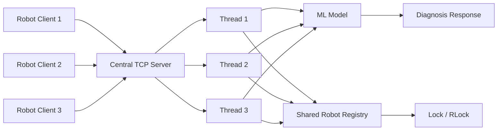

<!-- ======================================= ⚡️ Start DEFAULT HEADER ===========================================  -->


<!-- ========= START LANGUAGE BUTTON ========= -->
<br>

**\[[🇧🇷 Português](README.pt_BR.md)\] \[**[🇬🇧 English](README.md)**\]**

<br><br>
<!-- ========= END LANGUAGE BUTTON ========= -->


<!-- ========= START REPO TITLE ========= -->
# <p align="center"> 🕸️  [Distributed Systems]()  / [Project ROBOT Sentinel – Distributed TCP/IP Server with ML for Predictive Diagnostics]()  
### Distributed TCP/IP Server with ML for Predictive Diagnostics


<br><br>
<!-- ========= START REPO TITLE ========= -->


<!-- ========= START Institucional INFO ========= -->
## [Distributed Systems Integrated Project - PUC-SP 5th Semester (2026)]()


<br>

[**Institution:**]() Pontifical Catholic University of São Paulo (PUC‑SP – Humanistic AI & Data Science • 5º Semester • 2026)  <br>
[**School:**]() FACEI – Faculty of Interdisciplinary Studies  <br>
[**Course Repo:**]() **DISTRIBUTED SYSTEMS** – 108 Hours  <br>
**Professor:** [⭐️ **Carlos Eduardo Paes**]()  <br>
[**Extensionist Activities:**]() Extension projects and workshops using open‑source software and data‑driven consulting to support the community, aligned with the 20 official extension hours of the course.

<br><br><br><br>
<!-- ========= END Institucional INFO ========= -->


<!-- ========= START BADGES ========= -->
<p align="center">
  
  
  
  
  
  
  
  
</p>

#

<br><br>
<!-- ========= END START BADGES ========= -->


<!-- ========= START Confidentiality statement ========= -->

> [!MPORTANT]
> 
> ⚠️ Heads Up
>
> * Projects and deliverables may be made [publicly available]() whenever possible.
>   
> * The course emphasizes [**practical, hands-on experience**]() with real datasets to simulate professional consulting scenarios in the fields of **Machine Learning and Neural Networks** for partner organizations and institutions affiliated with the university.
>   
> * All activities comply with the [**academic and ethical guidelines of PUC-SP**]().
>   
> * Any content not authorized for public disclosure will remain [**confidential**]() and securely stored in [private repositories]().  
> <br>
>
>

<br><br><br><br>
<!-- ========= END Confidentiality statement  ========= -->

<!-- ======================================= END DEFAULT HEADER ⚡️ ===========================================  -->


## Table of Contents

- [Project overview](#project-overview)
- [Scenario and motivation](#scenario-and-motivation)
- [Repository structure](#repository-structure)
- [Project stages overview](#project-stages-overview)
- [Technical foundations](#technical-foundations)
  - [TCP/IP communication](#tcpip-communication)
  - [Multithreading](#multithreading)
  - [Synchronization and shared state](#synchronization-and-shared-state)
  - [Machine Learning inference](#machine-learning-inference)
- [Linux network tips](#linux-network-tips)
- [Stage 1 – 1_Robot_Fabi_Exploratory](#stage-1--1_robot_fabi_exploratory)
- [Stage 2 – 2_Robot_Pedro_Exploratory](#stage-2--2_robot_pedro_exploratory)
- [Stage 3 – 3-ROBOT_FINAL](#stage-3--3-robot_final)
- [System architecture](#system-architecture)
  - [Server flow](#server-flow)
  - [Architecture diagram](#architecture-diagram)
- [Final server](#final-server)
- [Final client](#final-client)
- [How to run](#how-to-run)
  - [Requirements](#requirements)
  - [Linux or macOS](#linux-or-macos)
  - [VS Code](#vs-code)
- [Commands supported](#commands-supported)
- [What each stage contributes](#what-each-stage-contributes)
- [Presentation guide](#presentation-guide)
- [Final note](#final-note)

---

## Project overview

ROBOT Sentinel is a distributed systems project that simulates predictive diagnostics in a Factory 4.0 environment. In this solution, robot clients send telemetry to a central TCP/IP server, which processes the data with a trained Machine Learning model and returns a diagnostic result in real time.

The repository is intentionally organized into **three evolutionary stages**, showing the progression from exploratory experimentation to a cleaner socket architecture and finally to the integrated version delivered in class. The final version combines networking, concurrency and intelligent diagnosis in a centralized server model.

---

## Scenario and motivation

The scenario represents an industrial environment in which dozens of robots operate with high precision and downtime is expensive. The main idea is to centralize intelligence in a more powerful server instead of making each robot process diagnostics locally.

This design creates three core technical challenges: handling many simultaneous network connections, performing accurate real-time anomaly detection, and protecting shared counters or robot state from race conditions. These three concerns are directly reflected in the project architecture and code evolution.

---

## Repository structure

```text
.
├── 1_Robot_Fabi_Exploratory/
│   ├── train_model.py
│   ├── servidor_central.py
│   └── no_sensor.py
│
├── 2_Robot_Pedro_Exploratory/
│   ├── robot_server.py
│   └── robot_client.py
│
└── 3-ROBOT_FINAL/
    ├── Bot Status Identificator.pkl
    ├── robot_server.py
    └── robot_client.py
```


---

## Project stages overview

| Stage / Folder | Focus | Key files | Main concepts |
| :-- | :-- | :-- | :-- |
| `1_Robot_Fabi_Exploratory` | Full exploratory prototype | `train_model.py`, `servidor_central.py`, `no_sensor.py` | Model training, JSON communication, TCP server, `Lock`-protected global alert counter, simulated robot client with reconnection logic |
| `2_Robot_Pedro_Exploratory` | Cleaner socket base | `robot_server.py`, `robot_client.py` | Simplified client–server separation, cleaner TCP skeleton, architectural refactoring for later expansion |
| `3-ROBOT_FINAL` | Final integrated solution | `robot_server.py`, `robot_client.py`, `Bot Status Identificator.pkl` | Centralized ML inference, shared robot registry, safer concurrent access, operational command protocol, clean session termination |


---

## Technical foundations

### TCP/IP communication

The project uses **TCP/IP** because the system depends on reliable and ordered communication between the robots and the central server. In a predictive diagnostics scenario, message loss or disorder would compromise the returned diagnosis and the integrity of the shared state maintained by the server.

This makes TCP a better fit than UDP for this assignment. The system is designed around request–response behavior and consistent server-side processing, not around best-effort or low-overhead delivery.

### Multithreading

One of the main requirements is that the server must handle multiple simultaneous network flows. The project addresses that by using threads so each client connection can be processed independently and the whole server does not stop when one robot is active.

This design is fundamental in distributed systems because it allows concurrent client handling and better reflects what a real central industrial node would do when many robots send data at the same time.

### Synchronization and shared state

Concurrency creates the need for synchronization. In the first exploratory implementation, the server maintains a global alert counter and protects updates with `threading.Lock()`, preventing failures in concurrent counting.

This directly addresses the race-condition problem described in the briefing. Later, in the final stage, that same idea evolves into a more structured shared robot registry with synchronized access to preserve consistency under concurrent operations.

### Machine Learning inference

The server should act as a centralized classifier, receiving robot features, preprocessing them, running inference and returning a diagnosis. That architecture appears clearly in the exploratory implementation and remains central to the final design.

The training script builds a dataset with `temperatura`, `vibracao` and `rpm`, trains a `RandomForestClassifier`, prints a classification report and serializes the model as a `.pkl` file for later use by the server. This allows the model to be loaded at runtime without retraining.

---

## Linux network tips

Before testing the project, it is useful to verify local network information, port listening state and loopback connectivity.

### Show IP addresses

```bash
ip addr
```


### Show listening ports

```bash
ss -tuln
```


### Show listening ports with processes

```bash
sudo ss -tulpn
```


### Test loopback connectivity

```bash
ping localhost
ping 127.0.0.1
```


### Quick summary

| Goal | Command |
| :-- | :-- |
| Show local IPs | `ip addr` |
| Show listening ports | `ss -tuln` |
| Show listening ports with process names | `sudo ss -tulpn` |
| Test connectivity | `ping localhost` |


---

## Stage 1 – `1_Robot_Fabi_Exploratory`

This stage is the first complete prototype of the project. It already demonstrates the full flow from data generation to server inference and diagnostic response, making it the most conceptually complete exploratory step.

### `train_model.py`

The script creates a structured dataset with the features `temperatura`, `vibracao` and `rpm`, and the target `falha`. It then splits the data, trains a `RandomForestClassifier`, prints a classification report and exports both the CSV dataset and the serialized model file.

Generated artifacts:

- `exemplo_dados.csv`
- `modelo_falha_rf.pkl`


### `servidor_central.py`

This server validates the model file before startup, loads it with `pickle`, listens on TCP, receives robot telemetry as JSON and classifies the data through a function that expects `temperatura`, `vibracao` and `rpm`. It returns either `"FALHA"` or `"NORMAL"` and also tracks the global number of alerts.

A strong point of this implementation is its robustness. It handles invalid UTF-8, invalid JSON, missing required fields, numeric conversion errors and internal exceptions, all while protecting the shared counter with `threading.Lock()`.

### `no_sensor.py`

This is a simulated robot client used for testing. It generates random sensor values periodically, sends them to the server in JSON format and logs the diagnosis returned by the server together with timestamps and the robot identifier.

It also implements reconnection behavior for timeouts, refused connections, connection reset and unexpected failures, which makes it useful for resilience testing during demonstrations.

---

## Stage 2 – `2_Robot_Pedro_Exploratory`

This stage focuses on simplification and architectural clarity. Instead of keeping the first prototype’s heavier end-to-end structure, it isolates the socket communication into a cleaner server–client base that can be extended later with intelligence and synchronization logic.

Its main value is educational and architectural. It turns the project into a more understandable network skeleton, which makes the final integrated version easier to develop, test and explain.

---

## Stage 3 – `3-ROBOT_FINAL`

This is the final version delivered for the course presentation. It extends the cleaner socket structure with centralized ML inference, robot registration, shared state and a command-based interaction model.

The final version includes:

- a pre-trained model file;
- a central threaded server;
- a client terminal for operational commands;
- shared robot tracking;
- support for clean disconnect behavior through a sentinel command.

---

## System architecture

The final system uses a centralized decision architecture. Robot clients act as distributed nodes that send operational data, while the server acts as the intelligence layer responsible for processing, diagnosis and state coordination. This directly matches the Factory 4.0 motivation in the project.

### Server flow

1. A robot client connects to the TCP server.
2. The server creates a dedicated thread to handle that connection.
3. The client may register, request the current robot list, send telemetry or terminate its session.
4. The server preprocesses the received payload and invokes the Machine Learning model.
5. The server returns a diagnosis and safely updates shared state whenever needed.

### Architecture diagram




---

## Final server

The final server is the central intelligence node of the system. It is responsible for accepting TCP connections, dispatching work per client, loading a trained model and coordinating shared information about connected robots.

Its main responsibilities are:

- accept client connections;
- manage one execution flow per client;
- interpret commands and telemetry payloads;
- perform ML inference;
- return diagnostics;
- maintain synchronized shared robot state.

This stage is especially important because it turns the earlier exploratory ideas into a more presentable distributed solution. Instead of being only a classifier endpoint, the server now behaves more like an operational control node.

---

## Final client

The final client is an interactive terminal interface that communicates with the central server. It supports operational commands and inference input, making it appropriate both for testing and for classroom demonstration.

Compared with the simulated sensor client from the first stage, this version is more explicit and user-driven. It allows the team to demonstrate robot registration, listing connected robots, sending model inputs and ending sessions cleanly.

---

## How to run

### Requirements

- Python 3.10+
- `joblib`
- `pandas`
- `scikit-learn`
- `numpy`
- `Bot Status Identificator.pkl` inside `3-ROBOT_FINAL/`


### Linux or macOS

1. Navigate to the final folder:
```bash
cd /path/to/3-ROBOT_FINAL
```

2. Create and activate a virtual environment:
```bash
python3 -m venv .venv
source .venv/bin/activate
pip install joblib pandas scikit-learn numpy
```

3. Optionally test local connectivity:
```bash
ping localhost
# or
ping 127.0.0.1
```

4. Start the server:
```bash
python3 robot_server.py
```

5. In another terminal, start one or more clients:
```bash
cd /path/to/3-ROBOT_FINAL
source .venv/bin/activate
python3 robot_client.py
```


### VS Code

Open the repository in VS Code, enter the `3-ROBOT_FINAL` folder and use the integrated terminal to run the same commands. During presentation, it is useful to keep one terminal for the server and two or three terminals for clients so concurrency becomes visible.

---

## Commands supported

The final interaction model is command-based, which improves clarity during testing and presentation. The final version supports registration, listing connected robots, sending inference data and terminating the session with a sentinel command.

Typical commands:

- `cadastro`
- `listar bots`
- feature vector payload
- `sair`

Example payload:

```text
10, 50, 70, 3, "v1.0"
```


---

## What each stage contributes

The first stage proves that the complete pipeline works: data generation, model training, TCP communication, diagnosis and concurrent alert counting. It is the most experimental but also the richest in functional demonstration.

The second stage improves software structure by simplifying the socket base. The third stage then combines architectural cleanliness with the intelligence and synchronization ideas introduced earlier, resulting in the final presented system.

---

## Presentation guide

### Suggested live demo

A strong presentation flow is:

1. Start the central server.
2. Open multiple client terminals.
3. Register clients with `cadastro`.
4. Show the result of `listar bots`.
5. Send one or more telemetry payloads.
6. Explain how the diagnosis is returned and how the shared state remains consistent under concurrent activity.

### Quick oral explanations

**Why TCP?**
Because the system needs reliable, ordered communication between robots and the central server. That is essential for valid diagnostics and consistent counters.

**Why threads?**
Because the server must handle multiple robots simultaneously without blocking other connections. That is one of the main distributed-systems requirements.

**Why `Lock` or `RLock`?**
Because shared state can be accessed by many threads at the same time. Synchronization prevents race conditions and preserves data integrity.

**Why a `.pkl` model file?**
Because the model is trained beforehand and then loaded directly by the server at runtime, which makes real-time inference practical during execution and presentation.

---

## Final note

ROBOT Sentinel documents the evolution of a distributed predictive-diagnostics system from exploratory prototype to integrated final solution. The final architecture combines TCP communication, multithreading, synchronization and Machine Learning inference in a way that reflects the goals of a Factory 4.0 classroom project.


