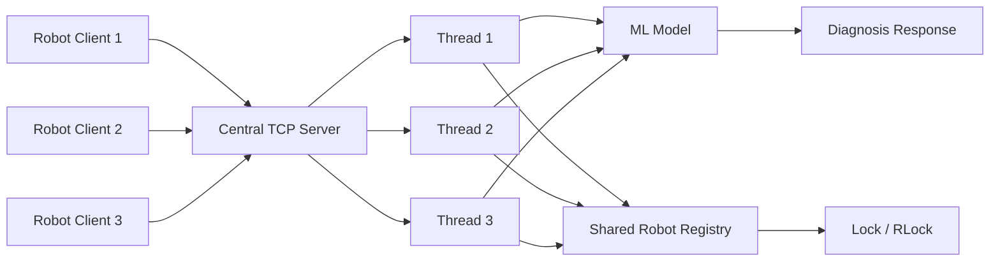

<!-- ======================================= ⚡️ Start DEFAULT HEADER ===========================================  -->


<!-- ========= START LANGUAGE BUTTON ========= -->
<br>

**\[[🇧🇷 Português](README.pt_BR.md)\] \[**[🇬🇧 English](README.md)**\]**

<br><br>
<!-- ========= END LANGUAGE BUTTON ========= -->


<!-- ========= START REPO TITLE ========= -->
# <p align="center"> 🕸️  [Distributed Systems]()  / [Project ROBOT Sentinel – Distributed TCP/IP Server with ML for Predictive Diagnostics]()  
### Distributed TCP/IP Server with ML for Predictive Diagnostics


<br><br>
<!-- ========= START REPO TITLE ========= -->


<!-- ========= START Institucional INFO ========= -->
## [Distributed Systems Integrated Project - PUC-SP 5th Semester (2026)]()


<br>

[**Institution:**]() Pontifical Catholic University of São Paulo (PUC‑SP – Humanistic AI & Data Science • 5º Semester • 2026)  <br>
[**School:**]() FACEI – Faculty of Interdisciplinary Studies  <br>
[**Course Repo:**]() **DISTRIBUTED SYSTEMS** – 108 Hours  <br>
**Professor:** [⭐️ **Carlos Eduardo Paes**]()  <br>
[**Extensionist Activities:**]() Extension projects and workshops using open‑source software and data‑driven consulting to support the community, aligned with the 20 official extension hours of the course.

<br><br><br><br>
<!-- ========= END Institucional INFO ========= -->


<!-- ========= START BADGES ========= -->
<p align="center">
  
  
  
  
  
  
  
  
</p>

#

<br><br>
<!-- ========= END START BADGES ========= -->


<!-- ========= START Confidentiality statement ========= -->

> [!MPORTANT]
> 
> ⚠️ Heads Up
>
> * Projects and deliverables may be made [publicly available]() whenever possible.
>   
> * The course emphasizes [**practical, hands-on experience**]() with real datasets to simulate professional consulting scenarios in the fields of **Machine Learning and Neural Networks** for partner organizations and institutions affiliated with the university.
>   
> * All activities comply with the [**academic and ethical guidelines of PUC-SP**]().
>   
> * Any content not authorized for public disclosure will remain [**confidential**]() and securely stored in [private repositories]().  
> <br>
>
>

<br><br><br><br>
<!-- ========= END Confidentiality statement  ========= -->

<!-- ======================================= END DEFAULT HEADER ⚡️ ===========================================  -->


## Table of Contents

- [Project overview](#project-overview)
- [Scenario and motivation](#scenario-and-motivation)
- [Repository structure](#repository-structure)
- [Project stages overview](#project-stages-overview)
- [Technical foundations](#technical-foundations)
  - [TCP/IP communication](#tcpip-communication)
  - [Multithreading](#multithreading)
  - [Synchronization and shared state](#synchronization-and-shared-state)
  - [Machine Learning inference](#machine-learning-inference)
- [Linux network tips](#linux-network-tips)
- [Stage 1 – 1_Robot_Fabi_Exploratory](#stage-1--1_robot_fabi_exploratory)
- [Stage 2 – 2_Robot_Pedro_Exploratory](#stage-2--2_robot_pedro_exploratory)
- [Stage 3 – 3-ROBOT_FINAL](#stage-3--3-robot_final)
- [System architecture](#system-architecture)
  - [Server flow](#server-flow)
  - [Architecture diagram](#architecture-diagram)
- [Final server](#final-server)
- [Final client](#final-client)
- [How to run](#how-to-run)
  - [Requirements](#requirements)
  - [Linux or macOS](#linux-or-macos)
  - [VS Code](#vs-code)
- [Commands supported](#commands-supported)
- [What each stage contributes](#what-each-stage-contributes)
- [Presentation guide](#presentation-guide)
- [Final note](#final-note)


<br><br>

## Project overview

ROBOT Sentinel is a distributed systems project that simulates predictive diagnostics in a Factory 4.0 environment. In this solution, robot clients send telemetry to a central TCP/IP server, which processes the data with a trained Machine Learning model and returns a diagnostic result in real time.

The repository is intentionally organized into **three evolutionary stages**, showing the progression from exploratory experimentation to a cleaner socket architecture and finally to the integrated version delivered in class. The final version combines networking, concurrency and intelligent diagnosis in a centralized server model.**


<br><br>


## Scenario and motivation

The scenario represents an industrial environment in which dozens of robots operate with high precision and downtime is expensive. The main idea is to centralize intelligence in a more powerful server instead of making each robot process diagnostics locally.

This design creates three core technical challenges: handling many simultaneous network connections, performing accurate real-time anomaly detection, and protecting shared counters or robot state from race conditions. These three concerns are directly reflected in the project architecture and code evolution.


<br><br>


## Repository structure

```text
.
├── 1_Robot_Fabi_Exploratory/
│   ├── train_model.py
│   ├── servidor_central.py
│   └── no_sensor.py
│
├── 2_Robot_Pedro_Exploratory/
│   ├── robot_server.py
│   └── robot_client.py
│
└── 3-ROBOT_FINAL/
    ├── Bot Status Identificator.pkl
    ├── robot_server.py
    └
```

<br><br>


## Project stages overview

| Stage / Folder | Focus | Key files | Main concepts |
| :-- | :-- | :-- | :-- |
| `1_Robot_Fabi_Exploratory` | Full exploratory prototype | `train_model.py`, `servidor_central.py`, `no_sensor.py` | Model training, JSON communication, TCP server, `Lock`-protected global alert counter, simulated robot client with reconnection logic |
| `2_Robot_Pedro_Exploratory` | Cleaner socket base | `robot_server.py`, `robot_client.py` | Simplified client–server separation, cleaner TCP skeleton, architectural refactoring for later expansion |
| `3-ROBOT_FINAL` | Final integrated solution | `robot_server.py`, `robot_client.py`, `Bot Status Identificator.pkl` | Centralized ML inference, shared robot registry, safer concurrent access, operational command protocol, clean session termination |


<br><br>


## Stage 1 – `1_Robot_Fabi_Exploratory`

This stage is the first complete prototype of the project. It already demonstrates the full flow from data generation to server inference and diagnostic response, making it the most conceptually complete exploratory step.

### `train_model.py`

The script creates a structured dataset with the features `temperatura`, `vibracao` and `rpm`, and the target `falha`. It then splits the data, trains a `RandomForestClassifier`, prints a classification report and exports both the CSV dataset and the serialized model file.

Generated artifacts:

- `exemplo_dados.csv`
- `modelo_falha_rf.pkl`


<br>

### `servidor_central.py`

This server validates the model file before startup, loads it with `pickle`, listens on TCP, receives robot telemetry as JSON and classifies the data through a function that expects `temperatura`, `vibracao` and `rpm`. It returns either `"FALHA"` or `"NORMAL"` and also tracks the global number of alerts.

A strong point of this implementation is its robustness. It handles invalid UTF-8, invalid JSON, missing required fields, numeric conversion errors and internal exceptions, all while protecting the shared counter with `threading.Lock()`.

<br>

### `no_sensor.py`

This is a simulated robot client used for testing. It generates random sensor values periodically, sends them to the server in JSON format and logs the diagnosis returned by the server together with timestamps and the robot identifier.

It also implements reconnection behavior for timeouts, refused connections, connection reset and unexpected failures, which makes it useful for resilience testing during demonstrations.


<br><br>

## Stage 2 – `2_Robot_Pedro_Exploratory`

This stage focuses on simplification and architectural clarity. Instead of keeping the first prototype’s heavier end-to-end structure, it isolates the socket communication into a cleaner server–client base that can be extended later with intelligence and synchronization logic.

Its main value is educational and architectural. It turns the project into a more understandable network skeleton, which makes the final integrated version easier to develop, test and explain.

<br><br>

## Stage 3 – `3-ROBOT_FINAL`

This is the final version delivered for the course presentation. It extends the cleaner socket structure with centralized ML inference, robot registration, shared state and a command-based interaction model.

<br>

The final version includes:

- a pre-trained model file;
- a central threaded server;
- a client terminal for operational commands;
- shared robot tracking;
- support for clean disconnect behavior through a sentinel command.

<br><br>

## System architecture

The final system uses a centralized decision architecture. Robot clients act as distributed nodes that send operational data, while the server acts as the intelligence layer responsible for processing, diagnosis and state coordination. This directly matches the Factory 4.0 motivation in the project.

<br><br>

### Server flow

1. A robot client connects to the TCP server.
2. The server creates a dedicated thread to handle that connection.
3. The client may register, request the current robot list, send telemetry or terminate its session.
4. The server preprocesses the received payload and invokes the Machine Learning model.
5. The server returns a diagnosis and safely updates shared state whenever needed.

<br><br>

### Architecture diagram

<br>




<br><br>


<br><br>
<br><br>
<br><br>
<br><br>
<br><br>
<br><br>
<br><br>
<br><br>
<br><br>


<!-- ======================================= Start DEFAULT Footer ===========================================  -->
<br><br>


## 💌 [Let the data flow... Ping Me !](mailto:fabicampanari@proton.me)

<br>


#### <p align="center">  🛸๋ My Contacts [Hub](https://linktr.ee/fabianacampanari)


<br>

### <p align="center"> 


<br><br>

<p align="center">  ────────────── ⊹🔭๋ ──────────────

<!--
<p align="center">  ────────────── 🛸๋*ੈ✩* 🔭*ੈ₊ ──────────────
-->

<br>

<p align="center"> ➣➢➤ <a href="#top">Back to Top </a>
  

  
#
 
##### <p align="center"> Copyright 2026 Quantum Software Development. Code released under the  [MIT license.](https://github.com/Mindful-AI-Assistants/CDIA-Entrepreneurship-Soft-Skills-PUC-SP/blob/21961c2693169d461c6e05900e3d25e28a292297/LICENSE)

